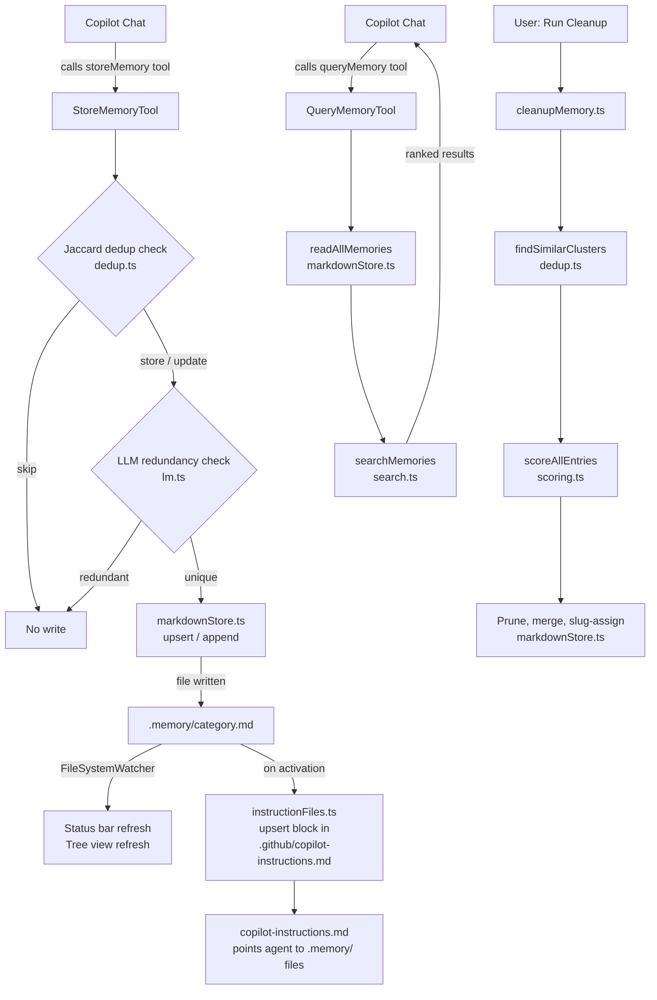

# Architecture

HackLM Memory is a VS Code extension that gives GitHub Copilot persistent, long-term memory across sessions. Memory is stored as Markdown bullet lists in a `.memory/` folder inside the workspace. A managed block in `.github/copilot-instructions.md` points the Copilot agent to those files so it fetches only what it needs, on demand.

## Data Flow

## Module Map

### Entry Point

| File | Responsibility |
|------|---------------|
| `extension/src/extension.ts` | Activates the extension. Registers LM tools, commands, tree view, status bar, file watcher. Shows consent toast on first run. Opens walkthrough on first activation. |

### Storage Layer (`extension/src/storage/`)

| File | Responsibility |
|------|---------------|
| `markdownStore.ts` | Read/write/delete memory entries from `.memory/*.md` files. Per-file mutex locks prevent concurrent read-modify-write races. Parses `- [slug] content` bullet format. |
| `dedup.ts` | Jaccard similarity deduplication. `SKIP_THRESHOLD=0.8`, `UPDATE_THRESHOLD=0.6`. Keyword extraction strips stop words. Also provides `findSimilarClusters()` for cleanup. |
| `scoring.ts` | Scores entries by category weight + brevity + specificity. Used by cleanup to prune lowest-value entries when a category exceeds its limit. |
| `search.ts` | Keyword-based search for `queryMemory`. Scores by keyword hit count + exact phrase bonus. Returns results ranked by score. |

### LM Tools (`extension/src/tools/`)

| File | Responsibility |
|------|---------------|
| `storeMemory.ts` | `StoreMemoryTool` — dedup check → optional LLM redundancy check → upsert or append. Triggers gap analysis every N stores. Shows confirmation prompt unless `autoApproveStore` is enabled. |
| `queryMemory.ts` | `QueryMemoryTool` — reads all memories, runs keyword search, formats results as `[Category] content` lines. |
| `cleanupMemory.ts` | `runCleanup()` — normalises raw lines, merges similar clusters (threshold 0.3), prunes over-limit entries by score, assigns slugs to untagged entries. |
| `sessionReview.ts` | `triggerGapAnalysis()` fires every 3rd store. `runSessionReview()` is user-invoked. Both use an LLM to find implied but uncaptured decisions and prompt the user to accept suggestions. |

### Infrastructure

| File | Responsibility |
|------|---------------|
| `lm.ts` | Single place for all LM calls. `resolveModel()` picks the configured model family. `sendLmRequest()` wraps `sendRequest` with cancellation token forwarding, timeout, and error logging. |
| `instructionFiles.ts` | Creates and upserts the `<!-- hacklm-memory:start/end -->` block in `.github/copilot-instructions.md`. Bootstraps `.memory/` files on first open. Strips legacy blocks. |
| `memoryPanel.ts` | QuickPick control panel — browse, delete, cleanup, settings. Settings UI lets user pick LM family from available Copilot models. |
| `memoryTreeView.ts` | `MemoryTreeProvider` — shows memories grouped by category in Explorer sidebar. `CategoryItem` and `MemoryItem` tree items with context-menu commands. |
| `statusBar.ts` | Left-aligned status bar item showing `Memory (N)`. Refreshes on file watcher events and on `onDidChangeChatModels`. |
| `toolIds.ts` | Single source of truth for LM tool name constants. |
| `utils.ts` | `getEffectiveLimit(category)` — reads per-category limit from VS Code config. |
| `outputChannel.ts` | Lazy singleton `OutputChannel` for cleanup reports and LM error logging. |

## Key Design Decisions

### Per-file Mutex Locks

`markdownStore.ts` maintains a `Map<filePath, Promise<void>>` as a chained promise queue. Every read-then-write operation on a `.memory/*.md` file acquires the lock for that specific file. This prevents concurrent `storeMemory` calls and background cleanup from corrupting the same file simultaneously.

### Centralised LM Access

`lm.ts` is the only module that calls `vscode.lm.selectChatModels` or `sendRequest`. All other modules call `resolveModel()` and `sendLmRequest()`. This keeps fallback logic, timeout handling, cancellation token forwarding, and error logging in one place.

### Two-tier Deduplication

1. **Write-time (fast)** — Jaccard similarity against existing entries. `SKIP_THRESHOLD=0.8` skips near-identical content. `UPDATE_THRESHOLD=0.6` replaces similar entries.
2. **Write-time (slow, optional)** — LLM redundancy check as a second pass for entries without a matching slug.
3. **Cleanup (separate)** — `findSimilarClusters()` uses a lower threshold (0.3 Jaccard) to catch semantically related entries the write-time thresholds missed. These thresholds are intentionally separate constants.

### On-demand Memory Injection

Rather than injecting the full memory store into `copilot-instructions.md`, the extension injects a reference table pointing the agent to specific `.memory/*.md` files. The agent fetches only the categories it needs for a given query. This keeps the instructions file small regardless of how much memory accumulates.

### Fail-open LM Calls

`sendLmRequest` always returns `string | null`. Callers treat `null` as "proceed without LM assistance." The extension degrades gracefully if Copilot is unavailable, has no models, or the LM call times out. Errors are logged to the output channel.

## VS Code API Dependency

This extension uses:

- `vscode.lm.registerTool` — to register `storeMemory` and `queryMemory` as LM tools
- `vscode.lm.selectChatModels` — to select a Copilot model for redundancy checks and gap analysis
- `vscode.lm.onDidChangeChatModels` — to refresh the status bar when available models change

These APIs require **VS Code 1.99+** (or any Open VSX-compatible editor that implements the VS Code LM Tool API at the same version level). Editors that do not implement `vscode.lm.registerTool` will install the extension but the memory tools will not be available in chat.

## Future: JetBrains Support

The storage layer (`dedup.ts`, `scoring.ts`, `search.ts`, `markdownStore.ts`) and the `.memory/*.md` file format are editor-agnostic. A future JetBrains plugin would need to:

1. Rewrite the VS Code-specific shell (`extension.ts`, `lm.ts`, `memoryPanel.ts`, `memoryTreeView.ts`, `statusBar.ts`) in Kotlin using the IntelliJ Platform SDK.
2. Extract the storage layer into a shared `core/` package (plain TypeScript/Node or a ported Kotlin library).
3. Implement the same `.memory/*.md` file format spec (documented in [api-reference.md](api-reference.md)).

See [ADR 0016](decisions.md#0016--vs-code-first-jetbrains-deferred) for the full decision record.
